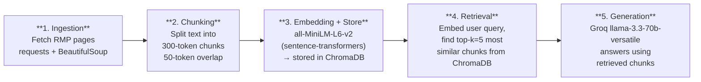

# Project 1 Planning: The Unofficial Guide

> Write this document before you write any pipeline code.
> Your spec and architecture diagram are what you'll use to direct AI tools (Claude, Copilot, etc.) to generate your implementation — the more specific they are, the more useful the generated code will be.
> Update the Retrieval Approach and Chunking Strategy sections if you change your approach during implementation.
> Update this file before starting any stretch features.

---

## Domain

Professor and course reviews for Colby College, sourced from Rate My Professors.
This knowledge is valuable because students rely heavily on peer advice when
choosing courses, but there's no easy way to query across multiple professors
at once. A RAG system lets students ask natural questions and get synthesized
answers across many reviews instantly.

---

## Documents

<!-- List your specific sources: URLs, subreddit names, forum threads, or file descriptions.
     Aim for at least 10 sources that together cover different subtopics or perspectives within your domain. -->

| # | Source | Description | URL or location |
|---|--------|-------------|-----------------|
| 1 | Rate My Professors | Colby professor reviews | https://www.ratemyprofessors.com/professor/132637 |
| 2 | Rate My Professors | Colby professor reviews | https://www.ratemyprofessors.com/professor/342085 |
| 3 | Rate My Professors | Colby professor reviews | https://www.ratemyprofessors.com/professor/3159202 |
| 4 | Rate My Professors | Colby professor reviews | https://www.ratemyprofessors.com/professor/952332 |
| 5 | Rate My Professors | Colby professor reviews | https://www.ratemyprofessors.com/professor/2232428 |
| 6 | Rate My Professors | Colby professor reviews | https://www.ratemyprofessors.com/professor/63976 |
| 7 | Rate My Professors | Colby professor reviews | https://www.ratemyprofessors.com/professor/64321 |
| 8 | Rate My Professors | Colby professor reviews | https://www.ratemyprofessors.com/professor/328533 |
| 9 | Rate My Professors | Colby professor reviews | https://www.ratemyprofessors.com/professor/2054082 |
| 10 | Rate My Professors | Colby professor reviews | https://www.ratemyprofessors.com/professor/1350504 |

---

## Chunking Strategy

<!-- How will you split documents into chunks?
     State your chunk size (in tokens or characters), overlap size, and explain why those
     numbers fit the structure of your documents.
     A review-heavy corpus warrants different chunking than a long FAQ. -->

**Chunk size:** 300 tokens

**Overlap:** 50 tokens

**Reasoning:** Rate My Professors reviews are short (1-5 sentences each).
A 300-token chunk fits 2-4 reviews together, giving enough context without
mixing too many professors. A 50-token overlap ensures a review that falls
on a chunk boundary isn't split in a way that loses meaning.

---

## Retrieval Approach

<!-- Which embedding model are you using (e.g., all-MiniLM-L6-v2 via sentence-transformers)?
     How many chunks will you retrieve per query (top-k)?
     If you were deploying this for real users and cost wasn't a constraint, what tradeoffs
     would you weigh in choosing a different embedding model — context length, multilingual
     support, accuracy on domain-specific text, latency? -->

**Embedding model:** all-MiniLM-L6-v2 via sentence-transformers

**Top-k:** 5

**Production tradeoff reflection:** In a real deployment I would consider
a larger model like text-embedding-3-large for better accuracy on
domain-specific student language (slang, shorthand). The tradeoff is
higher latency and cost. all-MiniLM-L6-v2 is fast and free, which fits
this project well.

---

## Evaluation Plan

<!-- List your 5 test questions with their expected correct answers.
     Questions should be specific enough that you can judge whether the system's response
     is right or wrong. "What are good dining halls?" is too vague.
     "What do students say about wait times at [dining hall name] during lunch?" is testable. -->

| # | Question | Expected answer |
|---|----------|-----------------|
| 1 | Which Colby professors are known for being engaging in lectures? | Names of professors frequently described as engaging or enthusiastic |
| 2 | Which professors have the lightest workload? | Names of professors reviewed as having manageable assignments |
| 3 | Which professors are recommended for students new to a subject? | Names of professors praised for being approachable and clear |
| 4 | What do students say about grading fairness at Colby? | Summary of reviews mentioning fair or unfair grading |
| 5 | Which professors give the most helpful feedback on assignments? | Names of professors noted for detailed or useful feedback |

---

## Anticipated Challenges

<!-- What could go wrong? Name at least two specific risks with reasoning.
     Consider: noisy or inconsistent documents, missing source attribution, off-topic
     retrieval, chunks that split key information across boundaries. -->

1. **Vague reviews:** Student reviews often use vague language ("great prof!", "hard but worth it") that may not retrieve well for specific questions about workload or teaching style.

2. **Cross-professor confusion:** Because all reviews are pooled into one vector store, a query about one professor could retrieve chunks about a different professor with similar reviews, leading the LLM to attribute the wrong opinions. I'll watch for this during evaluation and may add professor-name metadata

---

## Architecture

<!-- Draw a diagram of your pipeline showing the five stages:
     Document Ingestion → Chunking → Embedding + Vector Store → Retrieval → Generation
     Label each stage with the tool or library you're using.
     You can use ASCII art, a Mermaid diagram, or embed a sketch as an image.
     You'll use this diagram as context when prompting AI tools to implement each stage. -->

## AI Tool Plan

<!-- For each part of the pipeline below, describe:
     - Which AI tool you plan to use (Claude, Copilot, ChatGPT, etc.)
     - What you'll give it as input (which sections of this planning.md, which requirements)
     - What you expect it to produce
     - How you'll verify the output matches your spec

     "I'll use AI to help me code" is not a plan.
     "I'll give Claude my Chunking Strategy section and ask it to implement chunk_text()
     with my specified chunk size and overlap" is a plan. -->
     
**Milestone 3 — Ingestion and chunking:**
I'll use Claude. I'll give it my Documents table and Chunking Strategy section
along with the requirement that ingestion use requests + BeautifulSoup and
chunking use 300-token chunks with 50-token overlap. I expect it to produce
(a) a scraper that loops over my 10 RMP URLs and extracts review text plus the
professor name, and (b) a chunk_text() function that returns chunks at my
specified size and overlap with professor-name metadata attached. I'll verify
by checking that all 10 sources produce non-empty text files and by printing
sample chunks to confirm their token sizes match the spec.

**Milestone 4 — Embedding and retrieval:**
I'll use Claude. I'll give it my Retrieval Approach section, specifying
all-MiniLM-L6-v2 via sentence-transformers, storage in ChromaDB, and top-k=5.
I expect it to produce code that embeds every chunk, stores them in a ChromaDB
collection with their metadata, and runs a query by embedding the question and
returning the 5 most similar chunks. I'll verify by running test queries (e.g.
"engaging lecturer") and confirming the retrieved chunks are actually relevant
to the query.

**Milestone 5 — Generation and interface:**
I'll use Claude. I'll give it my full pipeline spec plus my Evaluation Plan
section. I expect it to produce code that takes a user question, retrieves the
top-5 chunks, builds a prompt containing those chunks as context, and calls the
Groq llama-3.3-70b-versatile model to generate an answer, plus a simple
command-line interface for asking questions. I'll verify by running my 5
evaluation questions and comparing each answer against my expected answers,
checking that the system cites information actually present in the reviews.
That's specific in the way the prompt asks for, it names the tool, the exact inputs (which planning sections), the expected output, and a concrete

